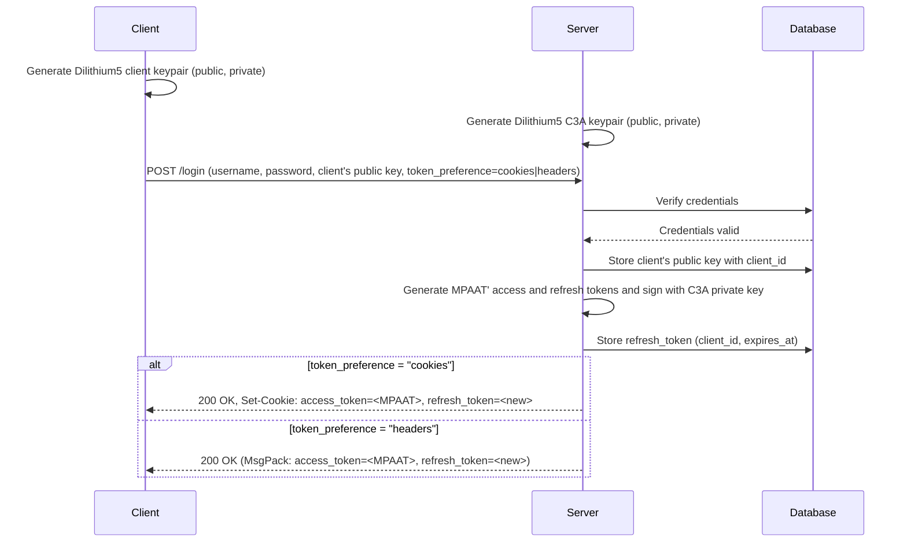
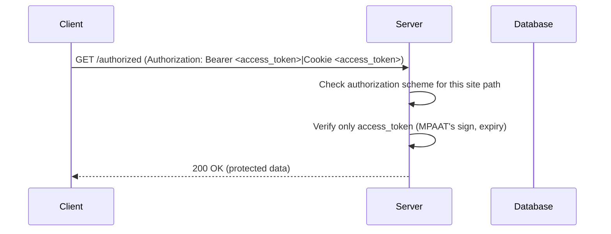
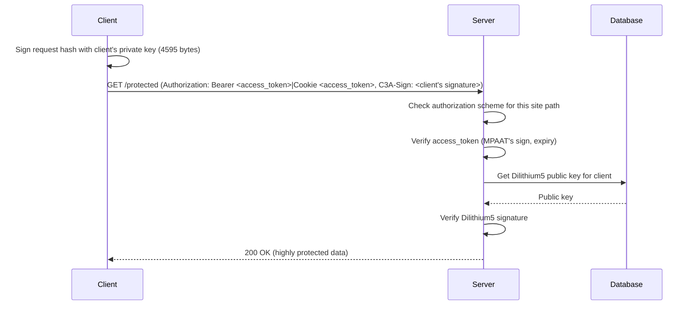
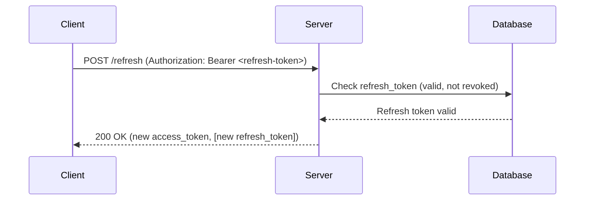
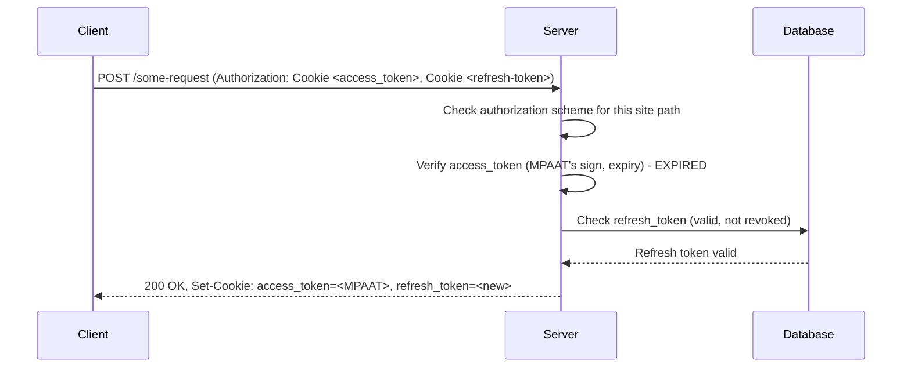
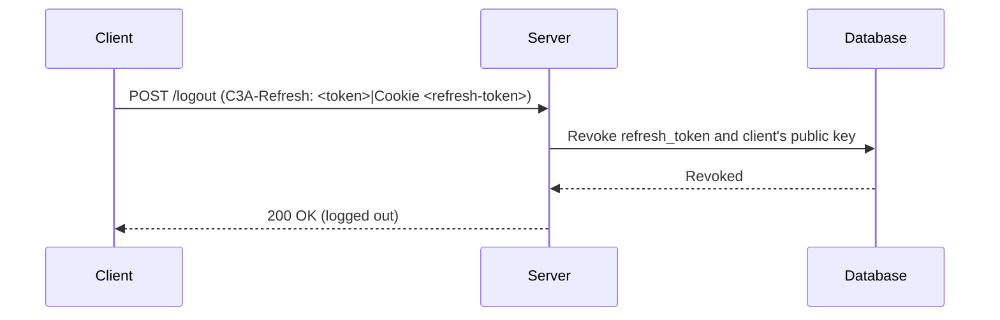

# C3A Design

1. Процесс регистрации.

Пользователь должен получить:

- способ идентификации
- возможные варианты формирования потока аутентификации

Пользователь должен предоставить:

- email или никнейм (в зависимости от настроек приложения) ([x] в настройках сделано)
- набор факторов аутентификации (настройки приложения определяют число + число разных, обязательные варианты и варианты на выбор)
